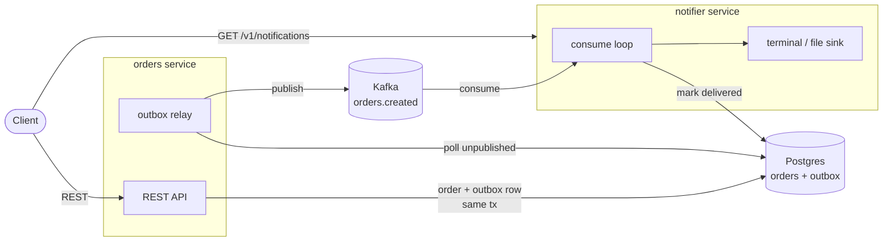

# Checkout

An event-driven checkout system built from two Go microservices:

* **orders** — a RESTful service for inventory and purchase orders.
* **notifier** — a background consumer that turns order events into notifications.

The two are decoupled by a **transactional outbox** and **Kafka**: a purchase and
its event are committed atomically, a relay publishes the event to the broker,
and the notifier consumes it, delivers a notification, and marks it delivered.

## Architecture



The outbox row tracks the full lifecycle: `created` → `published_at` (relay) →
`delivered_at` (notifier). Delivery is at-least-once, keyed on the event ID.

## Components

* Go HTTP server built with [httprouter](https://github.com/julienschmidt/httprouter) — high performance, panic recovery, shared across services.
* Multiple DB support: SQLite (in-memory and file) and Postgres, via [GORM](https://gorm.io/).
* Transactional outbox store for reliable event publishing.
* [Kafka](https://kafka.apache.org/) messaging via [franz-go](https://github.com/twmb/franz-go); a no-op client is the default so events are opt-in.
* `promotions` engine with composable deal strategies.
* Simple password authentication (`X-Auth-Password`) that resolves a user ID into the request context (a stepping stone to JWT).
* [Prometheus](https://prometheus.io/) metrics at `/metrics`, plus `/status` and `/health` probes.
* Build metadata (commit, date, dirty) stamped by the Go toolchain (`-buildvcs`).

## Code layout

```
.
├── main.go        // application entrypoint
├── cmd            // CLI (cobra/viper): `run orders`, `run notifier`, `version`, `health`
├── client         // HTTP client wrappers for the orders REST API
├── constants      // embedded version / build metadata
├── database       // GORM stores (inventory, orders, outbox) + interfaces
├── event          // transport-agnostic event envelope (encode/decode)
├── messaging      // Publisher/Consumer interfaces + kafka and noop clients
├── model          // database and API models
├── promotions     // composable promotion strategies
├── httpserver     // shared HTTP server, response/health helpers
│   ├── api        // endpoint registration
│   └── middleware // observability + auth middleware
├── services       // Service contract + per-service domain logic
│   ├── auth       // credential → user-ID resolution
│   ├── orders     // inventory + purchase REST API, outbox relay
│   ├── notifier   // event consumer + notification sink
│   └── worker     // background-goroutine lifecycle helper
├── integration    // testcontainer-based integration tests
└── docs
    ├── openapi     // generated OpenAPI/Swagger spec
    └── markdown    // design notes
```

## REST API

### Orders service (`run orders`)

| Method | Path | Auth | Description |
|--------|------|:----:|-------------|
| GET  | `/status` | | Service status |
| GET  | `/health` | | Service + dependency health (503 if unhealthy) |
| GET  | `/metrics` | | Prometheus metrics |
| GET  | `/v1/inventory/items` | | List inventory items |
| GET  | `/v1/inventory/item/price/:key` | | Price for a single item by SKU or name |
| POST | `/v1/inventory/item/price` | | Total price for a batch of SKUs |
| POST | `/v1/inventory/items` | ✅ | Add or update inventory items |
| POST | `/v1/inventory/items/purchase` | ✅ | Purchase a list of SKUs (records the buyer) |
| GET  | `/v1/orders` | ✅ | List the authenticated customer's orders |

**Purchase** (`POST /v1/inventory/items/purchase`)

```json
// request
{ "skus": ["SKU1", "SKU2"] }
// response
{ "order_reference": "b1c2...", "cost": 31.98 }
```

**Add items** (`POST /v1/inventory/items`)

```json
{ "items": [ { "name": "Item1", "sku": "SKU1", "price": 10.99, "inventory_quantity": 100 } ] }
```

### Notifier service (`run notifier`)

| Method | Path | Auth | Description |
|--------|------|:----:|-------------|
| GET | `/status` | | Service status |
| GET | `/health` | | Service + dependency health |
| GET | `/v1/notifications` | ✅ | List notifications; `?undelivered=true` filters to pending |

```json
// GET /v1/notifications
[ { "event_id": "37d6...", "reference": "b1c2...", "customer_id": "default-user",
    "occurred_at": "2026-07-23T15:39:31Z", "delivered": true } ]
```

### Authentication

Protected endpoints require a valid password in the `X-Auth-Password` header. The
shared password maps to a placeholder user ID until token auth lands.

### Error responses

```json
{ "error": "invalid input: ..." }
```

## Getting started

```bash
make build
./build/checkout --help          # subcommands: run, version, health
```

### Run the orders service (in-memory SQLite)

```bash
make run-orders
# or explicitly:
./build/checkout run orders --memory-db --password 1234
```

### Run against Postgres

```bash
./build/checkout run orders \
  --db-host <DB_HOST> --db-port <DB_PORT> \
  --db-user <DB_USER> --db-password <DB_PASSWORD> --password 1234
```

### Run the notifier

The notifier consumes from a broker, so pass `--event-broker` (and have the orders
service publish with the same broker). An optional `--notification-file` also
writes notifications to a file:

```bash
./build/checkout run notifier --event-broker <KAFKA_ADDR> --db-host <DB_HOST> ...
```

### Run the full event system with Docker

Brings up Postgres, Kafka, the orders service, and the notifier:

```bash
make docker             # build the image
make docker-run-events  # orders :8000, notifier :8001 (Postgres on :5433)
```

Other compose profiles: `make docker-run-postgres`, `make docker-run-sqlite`.

## Testing

```bash
make test              # unit tests (with coverage)
make test-integration  # testcontainer integration tests (Docker required)
```

## API documentation

Regenerate the OpenAPI/Swagger spec (written to `docs/openapi/`, importable into
Postman):

```bash
make openapi
```
