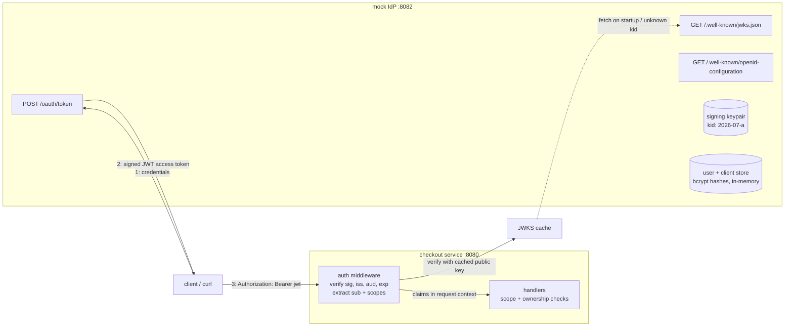

# Design: Auth Layer with Mock Identity Provider

**Status:** Draft — for review
**Author:** Alex Mackay
**Date:** 2026-07-16

## 1. Summary

Replace the checkout service's shared-password authentication with a
standards-shaped token architecture:

1. A new **mock identity provider (IdP)** — a separate process in this repo
   implementing a minimal but honest subset of **OAuth 2.0 / OIDC**: a token
   endpoint, a JWKS endpoint, and a discovery document. It issues signed
   **JWTs**.
2. The **checkout service becomes a resource server**: an auth middleware
   validates Bearer tokens against the IdP's published keys and enforces
   **scope-based authorization** per route, with **resource ownership**
   checks on top.

The goal is educational: understand what an IdP actually does, what token
validation involves, where the sharp edges are (algorithm confusion,
audience validation, key rotation, clock skew), and how authn (who are you)
differs from authz (what may you do) — by building both sides by hand.

### Goals

- Issue RS256-signed JWTs from a mock IdP with a real key lifecycle.
- Validate tokens in checkout via JWKS fetch + cache — no shared secrets
  between the services, which is the entire point of asymmetric signing.
- Route-level scope enforcement and record-level ownership enforcement.
- Retire `X-Auth-Password` at the end of the migration.
- Tests that attack the validator (expired, wrong audience, `alg=none`,
  key confusion), not just happy paths.

### Non-goals

- A real IdP (Keycloak/Auth0/Cognito). Running one teaches configuration;
  building a mock teaches the protocol.
- Full OIDC conformance, consent screens, social login, MFA.
- Sessions/cookies for a web frontend. Bearer tokens + curl only.
- Production-grade secret storage. Signing keys live in memory (regenerated
  on restart) or an optional PEM file for stable local dev.

## 2. Current state (the "before" picture)

Auth today is a single static password compared in middleware
(`X-Auth-Password` header) guarding two endpoints: `GET /v1/orders` and
`POST /v1/inventory/items`. Its problems are the syllabus:

| Problem | Consequence |
|---|---|
| Shared secret, one value for everyone | No identity — the server cannot know *who* called |
| No expiry | A leaked value is valid forever |
| No granularity | One password grants everything it guards |
| No revocation | Rotating it locks out every caller at once |
| Secret transmitted on every request | Every hop and log line is an exposure risk |

Every row above maps to a property of the token design in §4.

## 3. Proposed architecture



The critical property: **checkout never talks to the IdP to validate a
request.** It fetches the IdP's *public* keys (JWKS) rarely and verifies
signatures locally — validation is offline and adds no per-request network
hop. That asymmetry (IdP signs with the private key it alone holds;
resource servers verify with published public keys) is the core idea the
exercise exists to teach.

| Process | Command | Role |
|---|---|---|
| mock IdP | `checkout idp` (new subcommand) | issues tokens, publishes keys |
| checkout service | `checkout run` (unchanged) | resource server, validates tokens |

## 4. Token design

### 4.1 Access token claims

RS256-signed JWT, header carrying `kid`:

```json
{
  "iss": "http://idp:8082",
  "sub": "cust-0001",
  "aud": "checkout-api",
  "exp": 1789000000,
  "iat": 1788999100,
  "jti": "9f1c...uuid",
  "scope": "orders:read inventory:write",
  "name": "Alice Example"
}
```

- `sub` — stable principal ID. For customers this **is** the `customer_id`
  the notification-service spec currently fakes as a request field
  (`notification-service-design.md`, Open Question 1): once this lands,
  identity comes from the token, not the request body.
- `aud` — must be `checkout-api`. Validating audience is what stops a token
  minted for some other service being replayed here.
- `jti` — unique token ID; reserved for the revocation stretch goal.
- `scope` — space-delimited, per RFC 8693 conventions.

Access token TTL: **15 minutes**. Short enough that expiry is observed
during manual testing, long enough not to be annoying.

### 4.2 Scopes and route policy

| Route | Scope required |
|---|---|
| `GET /v1/orders` | `orders:read` |
| `POST /v1/inventory/items` | `inventory:write` |
| price/purchase endpoints | none in v1 (anonymous purchase preserved); tightening them is a one-line policy change once the middleware exists |
| `/status`, `/health`, `/metrics` | none, ever |

Authorization is two-layered, and the layers are different lessons:

1. **Scope check (middleware):** does this token permit this *route*?
2. **Ownership check (handler):** does this principal own this *record*?
   `GET /v1/orders` returns only orders whose `customer_id == sub` — which
   requires adding a `customer_id` column to `orders` (see §6). An `admin`
   scope bypasses ownership filtering.

Scopes alone are insufficient for row-level access — a valid
`orders:read` token for Alice must not read Bob's orders. Encountering
that gap first-hand is a milestone (M3), not a footnote.

### 4.3 Grant types

| Grant | Used by | Milestone |
|---|---|---|
| `client_credentials` | machine callers (admin tooling, integration tests) | M1 |
| `password` (Resource Owner Password) | human test users via curl | M3 |
| `refresh_token` | token renewal without re-sending credentials | M4 |
| authorization code + PKCE | browser flow with a minimal login page | M5 (stretch) |

Honest note: the password grant is **removed in OAuth 2.1** — real apps
must use authorization code + PKCE. It is used here at M3 because it is
the smallest curl-able flow that exercises user credentials, and graduating
from it to PKCE (M5) *is* the lesson about why redirects exist.

### 4.4 Package layout

```
idp/                  // NEW — mock identity provider
├── service.go        // lifecycle: HTTP server, key generation/loading
├── keys.go           // RSA keypair mgmt, kid assignment, JWKS rendering
├── token.go          // token endpoint: grant handling, JWT minting
├── store.go          // in-memory users + clients (bcrypt password hashes)
└── api.go            // routes: /oauth/token, /.well-known/*
auth/                 // NEW — resource-server side, importable middleware
├── middleware.go     // Bearer extraction, verification, claims → context
├── jwks.go           // JWKS fetch + cache (by kid, TTL + on-miss refresh)
├── claims.go         // typed Claims struct, context helpers, scope checks
└── policy.go         // route → required-scope table
```

Library: **`golang-jwt/jwt/v5`** for JWT signing/parsing, with the JWKS
client **written by hand** (`auth/jwks.go` — it is ~100 lines and teaches
exactly the caching/rotation mechanics that matter). Alternative
considered: `lestrrat-go/jwx` does JWKS out of the box, but outsources the
most instructive part.

## 5. Request validation path

```mermaid
sequenceDiagram
    participant C as client
    participant I as mock IdP
    participant M as checkout middleware
    participant H as handler

    Note over C,I: once per ~15 min
    C->>I: POST /oauth/token (grant_type, credentials)
    I->>I: verify credentials (bcrypt) / client secret
    I->>I: mint JWT: sub, aud, exp, scope; sign RS256 w/ kid
    I-->>C: { access_token, token_type: Bearer, expires_in: 900 }

    Note over C,H: every request
    C->>M: GET /v1/orders  Authorization: Bearer eyJ...
    M->>M: parse header; reject alg != RS256
    M->>M: look up kid in JWKS cache (miss → refetch from IdP, once)
    M->>M: verify signature, iss, aud, exp (±30s skew)
    M->>M: check route policy: needs orders:read ∈ scope
    M->>H: request + Claims{sub, scopes} in context
    H->>H: query orders WHERE customer_id = sub
    H-->>C: 200 [own orders only]
```

Failure modes are distinct on purpose — they are the observable behavior
the tests assert:

| Condition | Response |
|---|---|
| missing/malformed header | `401` + `WWW-Authenticate: Bearer` |
| bad signature, expired, wrong iss/aud, bad alg | `401` (log the *reason*, never echo it to the client) |
| valid token, missing scope | `403` |
| valid token + scope, not the owner | `404`/empty set (do not confirm the record exists) |

## 6. Checkout service changes

- New middleware chained ahead of protected handlers, replacing the
  password check. Route policy lives in one table (`auth/policy.go`), not
  scattered through handlers.
- `Claims` carried via `context.Context` with typed accessors — handlers
  never re-parse the token.
- `orders` table gains a `customer_id` column (indexed) written at purchase
  time; migration alongside the existing ones. Purchase remains anonymous
  in v1 (`customer_id` nullable / `"anonymous"`), populated when a token is
  present — the same identity the notification pipeline will key on.
- Config: `--idp-url` / `CHECKOUT_IDP_URL` (empty → auth disabled, legacy
  `X-Auth-Password` path retained; set → token auth replaces it). Same
  optional-dependency convention as `--kafka-brokers` in the notification
  spec.
- `X-Auth-Password` is deleted, not deprecated, at the end of M2 —
  keeping two auth paths alive indefinitely is how real systems accrete
  bypass bugs. (Open Question 2.)

## 7. Mock IdP behavior details

- **Keys:** RSA-2048 generated at startup; `kid` derived from key creation
  date. Optional `--signing-key <pem>` for a stable key across restarts
  (avoids re-fetching tokens every dev-loop restart).
- **JWKS:** `/.well-known/jwks.json` serves current + previous public keys
  (an array precisely so rotation, M4, is a data change not a schema
  change).
- **Discovery:** `/.well-known/openid-configuration` with `issuer`,
  `token_endpoint`, `jwks_uri` — checkout bootstraps from this single URL
  rather than three hardcoded ones.
- **Stores:** in-memory maps seeded at startup — a handful of users
  (bcrypt-hashed passwords) and clients (id + secret + allowed scopes),
  optionally overridable via a YAML seed file. No DB: losing users on
  restart is fine for the toy and keeps the IdP dependency-free.
- **Standard endpoints/conventions:** `/status`, `/health`, `/metrics`,
  cobra/viper config — same shape as the other services in this repo.

## 8. Local development

Additions to `docker-compose.yml`:

- `idp` — same image, `command: ["idp"]`, port 8082, new `auth` profile.
- checkout gains `CHECKOUT_IDP_URL: http://idp:8082` when the profile is on.

Manual smoke test:

```
docker compose --profile postgres --profile auth up -d

# 1. no token → 401
curl -i localhost:8080/v1/orders

# 2. get a token as alice (password grant, M3)
TOKEN=$(curl -s localhost:8082/oauth/token \
  -d grant_type=password -d username=alice -d password=pw \
  -d scope='orders:read' | jq -r .access_token)

# 3. inspect it — JWTs are readable, only the signature is magic
echo $TOKEN | cut -d. -f2 | base64 -d | jq

# 4. authorized call → alice's orders only
curl -H "Authorization: Bearer $TOKEN" localhost:8080/v1/orders

# 5. wrong scope → 403
curl -i -H "Authorization: Bearer $TOKEN" \
  -X POST localhost:8080/v1/inventory/items -d '{...}'
```

## 9. Testing strategy

| Layer | Approach |
|---|---|
| `idp` unit | grant handling table-driven: good/bad client secret, bad user password, disallowed scope request; minted-token claims round-trip |
| `auth` unit | **adversarial validator tests** — the heart of the exercise: expired token, not-yet-valid, wrong `iss`, wrong `aud`, `alg: none`, HS256-signed token (key-confusion attack), unknown `kid`, garbage header. Each MUST 401 |
| `auth/jwks` unit | cache hit path does zero HTTP calls (fake transport); unknown kid triggers exactly one refetch; refetch storms bounded |
| middleware unit | scope table enforcement: 401 vs 403 vs pass-through; claims present in context |
| integration | extend `integration/stack.go` with the IdP: full token → request flow; ownership isolation (alice cannot read bob's orders); expiry honored (mint 1-second token, wait, 401) |

Coverage ≥80% on `idp` and `auth`; `-race` throughout. The adversarial
suite is written **first** (TDD) — it defines what "validated" means before
any validation code exists.

## 10. Observability

- idp: `idp_tokens_issued_total{grant,status}`, `idp_jwks_requests_total`.
- checkout: `checkout_auth_requests_total{result}` (result ∈
  ok|no_token|invalid|expired|forbidden), `checkout_jwks_cache{event}`
  (hit|miss|refresh).

Auth failures are logged with reason + `sub` where parseable — never the
token itself. Tokens are credentials; they must not appear in logs.

## 11. Milestones (hand-build order)

1. **M1 — IdP core:** keypair + JWKS + discovery + `client_credentials`
   grant. Verify entirely with curl + [jwt.io](https://jwt.io)-style manual
   decode (§8 step 3).
2. **M2 — Resource server:** `auth` package (JWKS cache, validator,
   middleware, policy table) wired into checkout; adversarial test suite;
   `X-Auth-Password` deleted. The protected routes now require
   machine tokens.
3. **M3 — Users & ownership:** password grant, seeded users, `sub` →
   `customer_id` column on orders, ownership filtering + `admin` scope.
   The 403-vs-ownership distinction becomes testable.
4. **M4 — Lifecycle:** refresh tokens (opaque, stored server-side in the
   IdP — contrast with stateless access tokens); key rotation: add key B,
   sign with B, keep A in JWKS, observe zero-downtime cutover, drop A.
5. **M5 (stretch) — Authorization code + PKCE:** minimal HTML login page,
   redirect flow, code exchange. Retire the password grant, closing the
   OAuth 2.1 gap noted in §4.3.

## 12. Interaction with the notification-service path

The two specs are independent — either can be built first — but they meet
at identity:

- **Auth first:** the notification spec's Open Question 1 resolves itself —
  `customer_id` comes from the token's `sub`, the purchase-request field is
  never added, and the SSE stream authenticates with a Bearer token instead
  of a query parameter.
- **Notifications first:** ship with the `customer_id` request field as
  specced, then delete it in a small follow-up when auth lands.

Either order works; auth-first produces slightly less throwaway code,
notifications-first gets to the Kafka learning goals sooner.

## 13. Open questions

1. **Grant ordering:** keep the deprecated password grant as the M3
   stepping stone (assumed), or jump straight to auth code + PKCE and
   accept browser tooling earlier?
2. **Legacy auth:** delete `X-Auth-Password` at M2 (assumed) or keep it
   behind a flag until M3 lands user tokens?
3. **Purchase endpoint:** leave anonymous purchase allowed indefinitely, or
   require a token (any valid token, no scope) once M3 exists?
4. **JWKS client:** hand-rolled (assumed, for the learning value) vs
   `lestrrat-go/jwx`?
5. **Token TTL/skew numbers:** 15 min access / 30 s skew / 24 h refresh —
   any reason to vary for the toy?

## 14. Alternatives considered

- **Run a real IdP (Keycloak) in compose** — teaches configuration, not
  protocol; the resource-server half would still need building. Rejected
  for the learning goal, though pointing the finished `auth` package at
  Keycloak later is a good validation exercise (it should Just Work —
  that's what the standards buy).
- **HMAC (HS256) tokens** — symmetric signing means the checkout service
  could *mint* tokens, not just verify them, and every consumer shares one
  secret — recreating the shared-password problem with extra steps.
  Asymmetric-only, enforced in the validator.
- **Opaque tokens + introspection endpoint (RFC 7662)** — valid design
  (instant revocation, smaller tokens) but puts the IdP on every request's
  hot path; the JWT/JWKS model's offline validation is the more broadly
  applicable lesson. Worth a comparative note in the final write-up.
- **Sessions + cookies** — the right answer for a browser-first product,
  but drags in CSRF and cookie semantics; Bearer tokens keep the exercise
  API-shaped.
