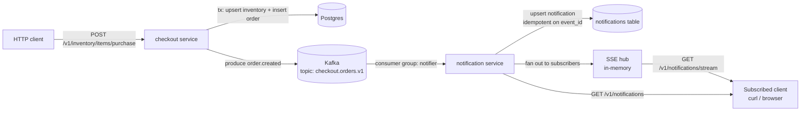
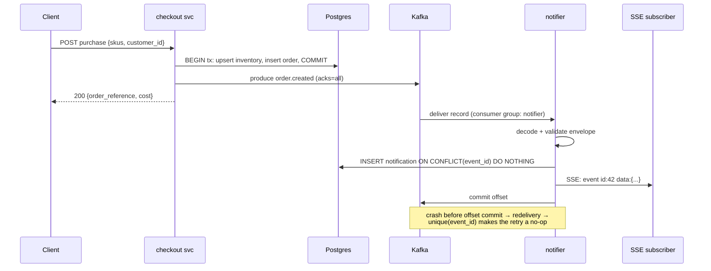

# Design: Event Streaming & Notification Service

**Status:** Draft — for review
**Author:** Alex Mackay
**Date:** 2026-07-16

## 1. Summary

Extend the checkout project with an event-driven notification pipeline:

1. The **checkout service** becomes an **event producer**, publishing domain
   events (starting with `order.created`) to **Kafka**.
2. A new **notification service** (separate process, same repo) **consumes**
   those events, persists notifications to an inbox store, and delivers them
   in realtime to connected clients over **Server-Sent Events (SSE)**.

The primary goal is educational: exercise Kafka producer/consumer mechanics,
consumer groups, at-least-once delivery, idempotent consumption, and the
realtime delivery patterns used in consumer-app backends — on top of a
codebase that already has a real transactional write path.

### Goals

- Publish a well-formed, versioned domain event when a purchase succeeds.
- Stand up Kafka locally via docker-compose alongside the existing stack.
- Build a notification consumer with a durable inbox and an SSE stream.
- At-least-once processing with idempotent (deduplicated) notification writes.
- Integration tests covering the full produce → consume → deliver path.

### Non-goals

- Mobile push (APNs/FCM), email, or SMS delivery.
- Multi-node WebSocket gateway fleets, presence registries, or Redis.
  SSE from a single notifier instance is sufficient for the toy.
- Real user accounts/authentication. A `customer_id` string stands in for
  identity (see §5 and Open Questions).
- Schema registry (Avro/Protobuf). Versioned JSON is fine at this scale.

## 2. Current state

- `service/` — stateless HTTP API (httprouter). `PurchaseItems` validates the
  request, applies promotions, then atomically upserts inventory and inserts
  the order inside `db.Transaction(...)` (`service/purchase.go`).
- `database/` — GORM behind a `Database` interface; SQLite and Postgres
  implementations plus a generated mock.
- `integration/` — spins up the full stack for black-box tests.
- `docker-compose.yml` — profiles for `postgres` and `sqlite` stacks.
- No messaging infrastructure of any kind today.

## 3. Proposed architecture



Two processes, one repo, one binary:

| Process | Command | Role |
|---|---|---|
| checkout service | `checkout run` (unchanged) | HTTP API + Kafka **producer** |
| notification service | `checkout notifier` (new subcommand) | Kafka **consumer** + inbox store + SSE/REST delivery |

Keeping both in one module/binary keeps the toy simple (shared `model`,
`database`, `constants` packages) while still exercising true inter-process,
broker-mediated communication.

## 4. Event design

### 4.1 Envelope

Every event shares a common envelope; the payload varies by type:

```json
{
  "event_id": "9f1c1a7e-...-uuid",
  "event_type": "order.created",
  "event_version": 1,
  "occurred_at": "2026-07-16T15:04:05Z",
  "producer": "checkout-svc",
  "payload": { ... }
}
```

- `event_id` — UUID generated at produce time. This is the **idempotency
  key**: consumers must treat two deliveries of the same `event_id` as one.
- `event_version` — payload schema version, bumped on breaking change.
- `occurred_at` — business time, distinct from Kafka's append time.

### 4.2 `order.created` payload (v1)

```json
{
  "order_reference": "9b2f...uuid",
  "customer_id": "cust-123",
  "skus": ["SKU1", "SKU2"],
  "price": "31.98"
}
```

`price` is a decimal string (matching `shopspring/decimal` semantics — never
a float in serialized form).

### 4.3 Topic & partitioning

| Property | Value | Rationale |
|---|---|---|
| Topic | `checkout.orders.v1` | Version in the name allows a clean v2 cutover |
| Partitions | 3 (local) | Enough to observe partition assignment & rebalancing |
| Key | `customer_id` | All of one customer's events stay ordered on one partition |
| Retention | broker default (7d) | Irrelevant at toy scale |
| Cleanup | delete (not compact) | It is an event log, not a changelog |

New event types (e.g. a future `order.shipped`) go on the **same topic**
keyed the same way, so per-customer ordering holds across types. Splitting
by aggregate ("all order events on the orders topic") is the conventional
middle ground between topic-per-event-type and one-big-topic.

### 4.4 Package layout

```
messaging/            // NEW — shared event types + Kafka helpers
├── events.go         // Envelope, OrderCreated payload, event type constants
├── producer.go       // Producer interface + Kafka impl + no-op impl
└── consumer.go       // Consumer loop helper (used by notifier)
notifier/             // NEW — notification service
├── service.go        // lifecycle: consumer loop + HTTP server
├── inbox.go          // notification store (GORM, notifications table)
├── hub.go            // in-memory SSE hub: register/unregister/broadcast
└── api.go            // GET /v1/notifications, GET /v1/notifications/stream
```

Go client library: **franz-go** (`github.com/twmb/franz-go`) — pure Go, no
cgo, actively maintained, supports consumer groups out of the box.
Alternative considered: `segmentio/kafka-go` (simpler API, slower
maintenance cadence). Either works; the spec assumes franz-go.

## 5. Producer changes (checkout service)

1. `model.PurchaseItemsRequest` gains an **optional** `customer_id` field.
   Empty value defaults to `"anonymous"`. This is the subscription/routing
   key for notifications (stand-in for real auth).
2. `Service` gains a `producer messaging.Producer` dependency (small
   consumer-site interface, mockable):

   ```go
   type Producer interface {
       Publish(ctx context.Context, key string, evt *Envelope) error
       io.Closer
   }
   ```

3. `PurchaseItems` publishes `order.created` **after the DB transaction
   commits**. Publish failure is logged and counted in metrics but does
   **not** fail the HTTP request — the order exists; the event is
   best-effort in v1 (see §7 for the honest discussion of this gap).
4. Kafka is **optional at startup**: no `--kafka-brokers` flag → no-op
   producer, service behaves exactly as today. Existing tests keep passing.

New config (flag / env, following existing cobra/viper conventions):

| Flag | Env | Default |
|---|---|---|
| `--kafka-brokers` | `CHECKOUT_KAFKA_BROKERS` | `""` (disabled) |
| `--kafka-topic` | `CHECKOUT_KAFKA_TOPIC` | `checkout.orders.v1` |

## 6. Notification service

### 6.1 Consumer loop

- Consumer group `notifier` subscribed to `checkout.orders.v1`.
- For each record: decode envelope → validate → **upsert** notification →
  broadcast to SSE hub → **commit offset only after the DB write succeeds**.
- Unknown `event_type`/`event_version`: log at WARN, count in metrics, skip
  (commit). Malformed JSON: same. A toy doesn't need a DLQ, but the skip
  path must be explicit and observable, not silent.

### 6.2 Inbox store

`notifications` table (own GORM model, migration alongside the existing
ones):

| Column | Type | Notes |
|---|---|---|
| `id` | integer PK | |
| `event_id` | text, **unique index** | idempotency: upsert on conflict do nothing |
| `customer_id` | text, index | subscription key |
| `type` | text | e.g. `order.created` |
| `title` / `body` | text | rendered human-readable message |
| `created_at` | timestamp | |
| `read` | boolean, default false | reserved for a mark-read stretch goal |

The unique index on `event_id` is what converts Kafka's at-least-once into
exactly-once *effect* on the inbox.

### 6.3 Delivery API

| Endpoint | Description |
|---|---|
| `GET /v1/notifications?customer_id=X&after_id=N` | Inbox sync: notifications for X newer than N. **This is the source of truth.** |
| `GET /v1/notifications/stream?customer_id=X` | SSE stream. Realtime push of new notifications; each SSE event carries the notification JSON and its `id` as the SSE `id:` field. |
| `GET /status`, `GET /health`, `GET /metrics` | Same conventions as the checkout service. |

SSE over WebSocket, deliberately: delivery is server→client only, SSE is
plain HTTP (works with `curl -N`), reconnection with `Last-Event-ID` is
built into the protocol, and there is no gateway/presence problem at
single-instance scale. A client that reconnects replays missed items via
the inbox endpoint (or `Last-Event-ID`); the stream is an optimization,
the inbox is the guarantee.

### 6.4 SSE hub

In-memory registry: `map[customerID]map[*subscriber]struct{}` guarded by a
mutex, each subscriber a buffered channel drained by its HTTP handler.
Slow/full subscriber → drop the event for that subscriber (it will re-sync
from the inbox), never block the consumer loop. Follows the existing
WaitGroup + quit-channel lifecycle style used elsewhere in the repo.

## 7. Reliability semantics (the interesting bit)



Guarantees, stated honestly:

- **Producer → broker:** `acks=all` with retries. But publish happens
  *after* the DB commit, so a crash in the gap between commit and publish
  **loses the event** (order exists, no notification). This is the classic
  dual-write problem. Fixing it properly is the **transactional outbox**
  pattern — write the event into an `outbox` table inside the same DB
  transaction as the order, and relay outbox rows to Kafka from a background
  loop. Deliberately deferred to Milestone 5 so the failure mode is
  *experienced* before the fix is built.
- **Broker → consumer:** at-least-once (offset committed after processing).
  Duplicates are expected and neutralized by the `event_id` unique index.
- **Consumer → SSE client:** best-effort. Missed events are recovered from
  the inbox endpoint. No delivery guarantee on the stream by design.
- **Ordering:** per-customer, via partition key. No global ordering, and
  none needed.

## 8. Local development

Additions to `docker-compose.yml`:

- `kafka` — single-node Apache Kafka in **KRaft mode** (no ZooKeeper),
  e.g. `apache/kafka:3.9.x`, new `kafka` profile, healthcheck via
  `kafka-broker-api-versions.sh`. Topic auto-creation off; an init
  one-shot container creates `checkout.orders.v1` with 3 partitions.
- `notifier` — same image as checkout, `command: ["notifier"]`, port 8081.
- Optional: `redpanda` console or `kafka-ui` container for browsing topics
  (nice for learning, not required).

Manual smoke test:

```
docker compose --profile postgres --profile kafka up -d
curl -N 'http://localhost:8081/v1/notifications/stream?customer_id=cust-1' &
curl -X POST localhost:8080/v1/inventory/items/purchase \
  -d '{"skus":["SKU1"],"customer_id":"cust-1"}'
# → SSE event appears on the stream within ~100ms
curl 'http://localhost:8081/v1/notifications?customer_id=cust-1'
```

## 9. Testing strategy

| Layer | Approach |
|---|---|
| `messaging` unit | Envelope encode/decode round-trip, versioning, table-driven |
| producer unit | Mock `Producer` on `Service`; assert publish-after-commit ordering and that publish failure ≠ HTTP failure |
| notifier unit | Consumer handler fed synthetic records: dedupe on `event_id`, unknown-type skip, malformed-JSON skip; SSE hub subscribe/broadcast/slow-client tests with `goleak` |
| integration | Extend `integration/stack.go` with Kafka (testcontainers or compose): purchase → poll inbox endpoint until notification appears; duplicate-event injection → single inbox row; notifier-restart → resumes from committed offset |

Coverage target ≥80% on `messaging` and `notifier` business logic, per repo
standards. `-race` on everything (the SSE hub is concurrency-heavy).

## 10. Observability

Prometheus, following the existing `service/metrics.go` conventions:

- checkout: `checkout_events_published_total{type,status}`.
- notifier: `notifier_events_consumed_total{type,status}` (status ∈
  ok|duplicate|skipped|error), `notifier_consumer_lag` (gauge),
  `notifier_sse_subscribers` (gauge), `notifier_sse_dropped_total`.

## 11. Milestones (hand-build order)

Each milestone is independently mergeable and testable:

1. **M1 — Plumbing:** Kafka in docker-compose; `messaging` package with
   envelope types + producer; checkout publishes `order.created`; verify
   with `kafka-console-consumer`. *(No notifier yet.)*
2. **M2 — Consumer:** notifier subcommand consuming the topic, logging
   events, `/status` + `/health` + `/metrics` endpoints. Kill/restart it and
   observe consumer-group offset resume and rebalancing.
3. **M3 — Inbox:** notifications table, idempotent upsert, inbox REST
   endpoint. Prove dedupe by producing the same `event_id` twice.
4. **M4 — Realtime:** SSE hub + stream endpoint. The smoke test in §8 works
   end-to-end.
5. **M5 (stretch) — Outbox:** move publish into the purchase transaction
   via an outbox table + relay goroutine; kill the service between commit
   and publish to demonstrate the failure M1 shipped with, then show it's
   gone.

## 12. Open questions

1. **Identity:** is an optional `customer_id` request field acceptable, or
   should it ride the existing `X-Auth-Password` header path some other way?
2. **Notifier DB:** share the checkout Postgres instance (simple, one
   compose service) or give the notifier its own store (purer
   service-per-database, more compose)? Spec assumes **shared instance,
   separate table** for the toy.
3. **Client library:** franz-go (assumed) vs segmentio/kafka-go — any
   preference given the hand-written constraint? franz-go's consumer-group
   API is more to learn but closer to the real Java client's concepts.
4. **Same binary vs separate module:** spec assumes one binary with a
   `notifier` subcommand. A fully separate Go module under the repo would
   be more "microservice-y" but adds module-management friction.

## 13. Alternatives considered

- **Redpanda instead of Kafka** — lighter single container, Kafka-API
  compatible. Rejected only because the learning goal is Kafka itself;
  swapping the compose image later is trivial.
- **WebSocket instead of SSE** — bidirectional capability is unused for a
  notification feed; SSE is less code by hand and curl-testable.
- **Postgres LISTEN/NOTIFY instead of a broker** — would work for this
  scale but defeats the purpose (no consumer groups, offsets, partitions).
- **Synchronous HTTP call from checkout to notifier** — no decoupling, no
  buffering, notifier downtime would break purchases; exactly the
  anti-pattern the broker exists to avoid.
